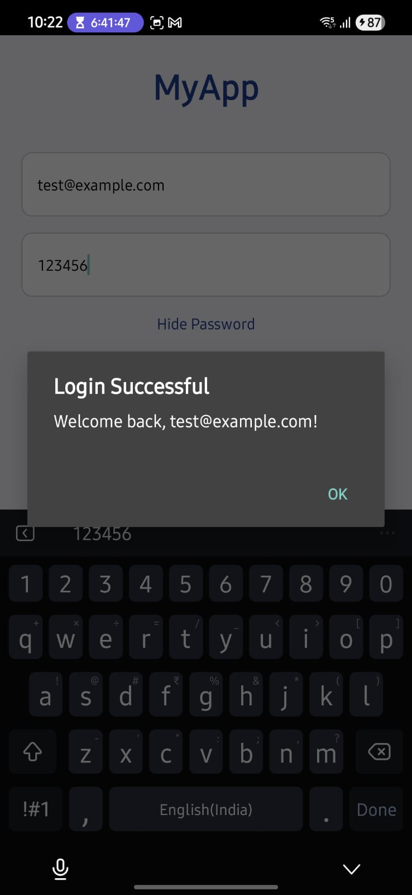
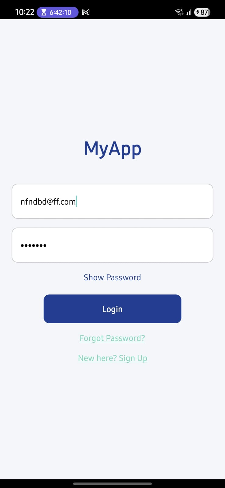

# React Native Login Screen (With Simulated Backend)

A simple and responsive **Login Screen** built using React Native (Expo).  
Includes input validation, password visibility toggle, and simulated backend integration via a local `.json` file.

---

##  Features

- ✅ Email & Password Inputs
- ✅ Password Show/Hide Toggle
- ✅ Input Validation (Email format, empty fields)
- ✅ Alert on Login with user info
- ✅ "Forgot Password?" & "Sign Up" links (non-functional placeholders)
- ✅ Simulated Backend Authentication (with `credentials.json`)
- ✅ Fully Responsive Layout

---

##  Sample Credentials

Use the following credentials to test a successful login:

```json
{
  "email": "test@example.com",
  "password": "123456"
}
```

## ScreenShots 
<p float="left">
  
  
</p>
